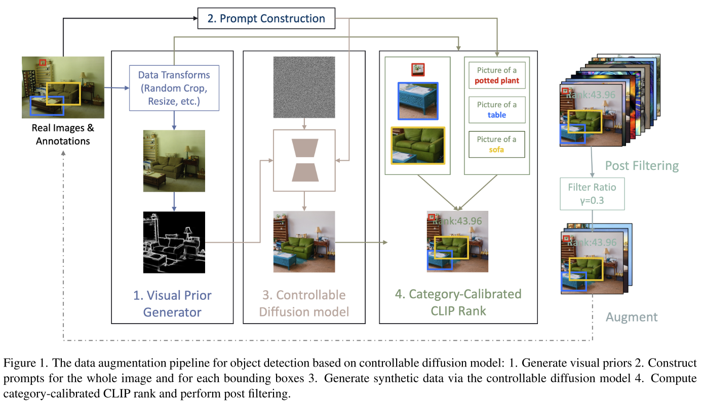
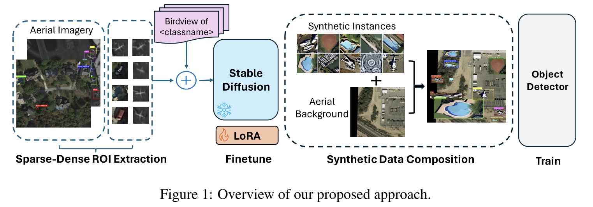

```
```
# 1 diffusion model on object detection
### 1.1 DiffusionDet: Diffusion Model for Object Detection
```
对 box 作 diffusion 操作，与图像生成相关的 sd 模型不太一样，latent features 用于 predict box 的生成。
这里的模型结构与一般的sd模型也不太一样。
```
### 1.2 Data Augmentation for Object Detection via Controllable Diffusion Models
```
使用了 controllable diffusion 去生成合成图片，使用CLIP校准并过滤box。
```

### 1.3 DiffusionEngine: Diffusion Model is Scalable Data Engine for Object Detection
```
扩展了目标识别数据集，也是通过cross-attention的想法识别目标
```

### 1.4 Stable Diffusion For Aerial Object Detection
```
做到了遥感图像的份小目标识别。1）从真实图像上剪切图像，添加prompt："birdview of <class name>"，Lora微调；
2）生成图像，添加到真实的遥感图像上，用这个去训练目标识别的task。
```
