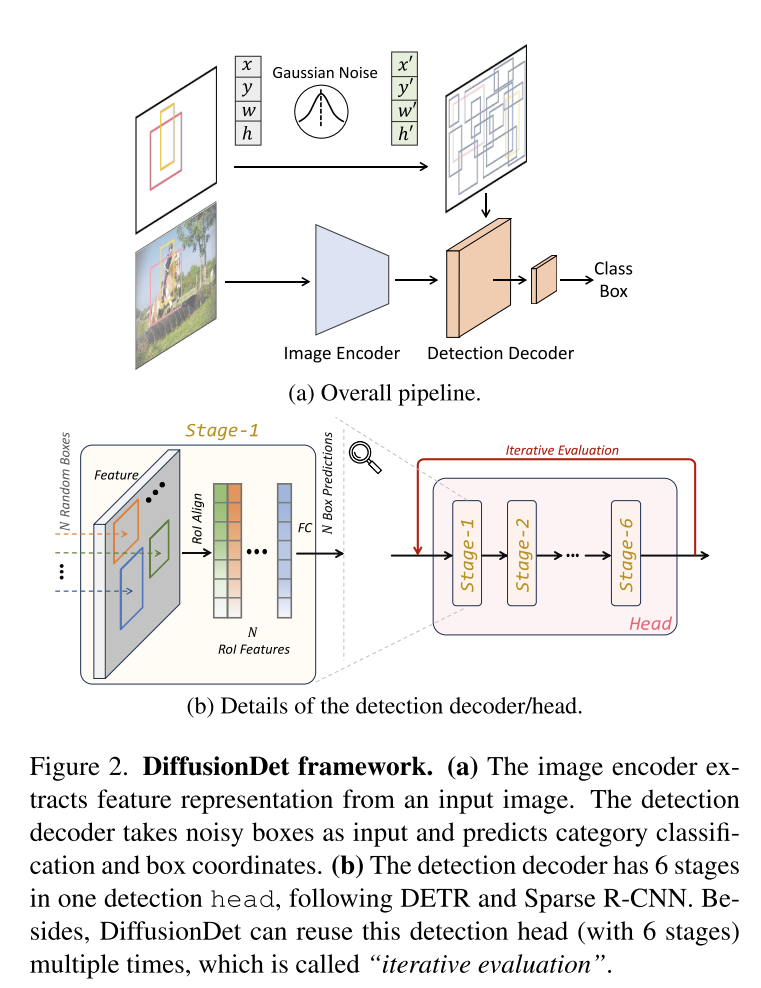
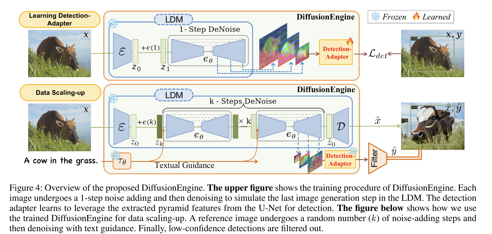
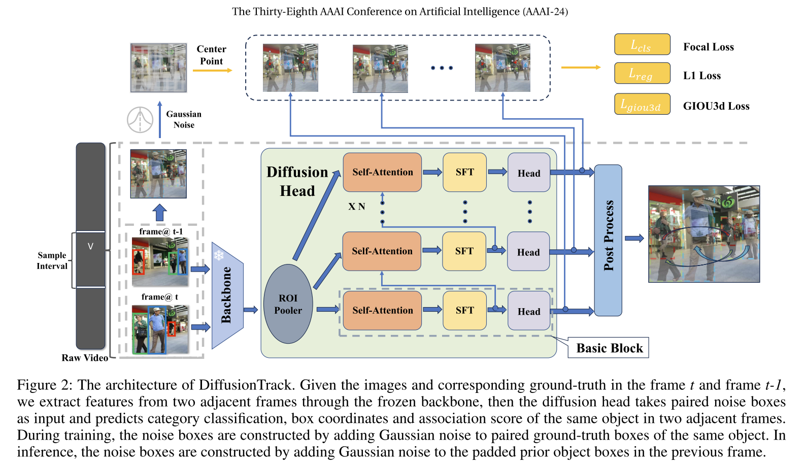
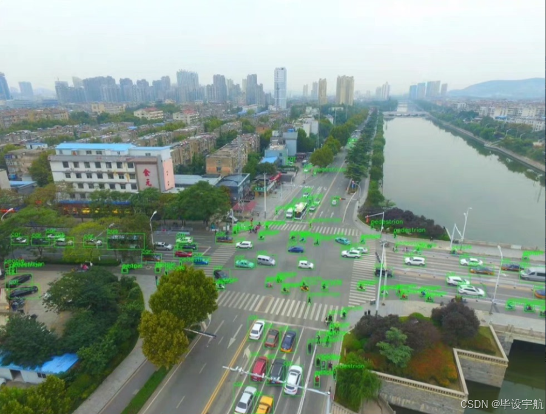

# 1 diffusion model on object detection

## 1.1 DiffusionDet: Diffusion Model for Object Detection
对 box 作 diffusion 操作，与图像生成相关的 sd 模型不太一样，latent features 用于 predict box 的生成。

这里的模型结构与一般的sd模型也不太一样。

## 1.2 Data Augmentation for Object Detection via Controllable Diffusion Models
使用了 controllable diffusion 去生成合成图片，使用CLIP校准并过滤box。

有个疑问点，prompt和box是一起准备的。

## 1.3 DiffusionEngine: Diffusion Model is Scalable Data Engine for Object Detection
扩展了目标识别数据集，也是通过cross-attention的想法识别目标

crossed-attention也有无法识别的问题

## 1.4 Stable Diffusion For Aerial Object Detection
做到了遥感图像的份小目标识别。1）从真实图像上剪切图像，添加prompt："birdview of <class name>"，Lora微调； 2）生成图像，添加到真实的遥感图像上，用这个去训练目标识别的task。

**我觉得可以尝试迁移到语义分割上做。目前正在尝试。**

## 1.5 DiffusionTrack: Diffusion Model For Multi-Object Tracking
不太看到明白,好像是通过计算两个box的关联度来达到追踪的效果。

# 2 dataset related to flood detention basin

## 2.1 VisDrone
VisDrone 是一个旨在解决无人机平台上视觉任务的大规模基准数据集。它包括了目标检测、多目标跟踪、单目深度估计等多个子任务。
类别数 names: [0: 'pedestrian',1: 'people', 2:'bicycle', 3:'car', 4:'van',5: 'truck',6: 'tricycle',7: 'awning-tricycle',8: 'bus',9: 'motor' ]

